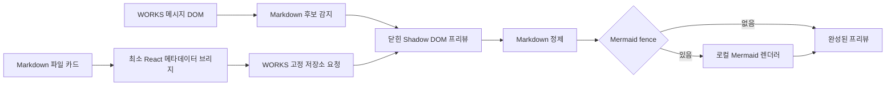

# WORKS Markdown Preview

NAVER WORKS 웹 채팅에서 Markdown 메시지와 `.md`/`.markdown` 첨부 파일을 원문 바로 아래에서 미리 보는 Chromium 확장 프로그램입니다. Mermaid 코드 블록도 안전한 SVG 다이어그램으로 렌더링합니다.

원래 메시지, 파일 카드, 읽음 상태, 반응, 전달·저장 메뉴는 변경하지 않습니다.

## 주요 기능

- Markdown이 감지된 메시지 아래에 `프리뷰 보기` 버튼 표시
- `.md`와 `.markdown` 파일 카드 아래에 동일한 프리뷰 제공
- 제목, 목록, 표, 인용문, 링크, 인라인 코드, fenced code block 지원
- `mermaid` fenced code block을 SVG 다이어그램으로 렌더링
- 받은 메시지와 보낸 메시지의 좌우 정렬 지원
- 창 크기와 채팅 영역 폭이 바뀌어도 프리뷰 위치 자동 보정
- WORKS 대화방 전환, 검색 결과, 새 메시지와 DOM 교체 대응
- 만료 파일 사전 확인과 파일별 오류 표시
- 닫힌 Shadow DOM을 사용해 WORKS 스타일과 프리뷰 스타일 격리

## 지원 환경

| 항목 | 지원 범위 |
| --- | --- |
| 브라우저 | Chromium 기반 Chrome, Brave |
| 대상 페이지 | `https://talk.worksmobile.com/*` |
| 메시지 | 의미 있는 Markdown 문법이 포함된 텍스트 |
| 첨부 파일 | UTF-8 `.md`, `.markdown` |
| 파일 크기 | 최대 1 MiB |
| 다이어그램 | Mermaid flowchart, sequence, class, state 등 |

Firefox, 모바일·데스크톱 네이티브 WORKS 앱, Markdown 편집, 임의 `.txt` 파일은 현재 지원하지 않습니다.

## 설치

### 배포 ZIP 사용

[`WORKS-Markdown-Preview-0.1.2.zip` 바로 다운로드](https://github.com/Ray-kong/Naver-Works-Markdown/raw/refs/heads/main/releases/WORKS-Markdown-Preview-0.1.2.zip)

1. 위 링크에서 `WORKS-Markdown-Preview-0.1.2.zip`을 내려받아 원하는 폴더에 압축 해제합니다.
2. Chrome에서는 `chrome://extensions`, Brave에서는 `brave://extensions`를 엽니다.
3. 우측 상단의 **개발자 모드**를 켭니다.
4. **압축해제된 확장 프로그램을 로드합니다**를 선택합니다.
5. 압축을 푼 폴더를 지정합니다.
6. 열려 있던 NAVER WORKS 탭을 새로고침합니다.

### 소스에서 빌드

Node.js와 npm이 설치된 환경에서 다음 명령을 실행합니다.

```powershell
npm ci
npm run check
```

빌드가 완료되면 확장 프로그램 관리 화면에서 생성된 `dist` 폴더를 불러옵니다.

## 사용법

Markdown 메시지나 지원되는 파일이 감지되면 원문 또는 파일 카드 아래에 `프리뷰 보기` 버튼이 나타납니다.

1. `프리뷰 보기`를 눌러 렌더링된 내용을 엽니다.
2. 다시 누르면 프리뷰가 접힙니다.
3. Mermaid가 포함된 경우 다이어그램 렌더러는 프리뷰를 처음 열 때만 로드됩니다.

### Mermaid 예시

````markdown

````

Mermaid fence의 언어 이름이 정확히 `mermaid`인 경우에만 다이어그램으로 처리됩니다.

## 보안과 개인정보 보호

- 메시지와 파일 내용은 현재 WORKS 탭 안에서만 처리합니다.
- 첨부 파일은 WORKS가 사용하는 고정 저장소 `storage.worksmobile.com`에서 현재 로그인 세션으로만 읽습니다.
- 파일 저장, 메시지 전송, 수정, 전달 또는 삭제를 수행하지 않습니다.
- 메시지 내용, 파일 본문, 리소스 경로와 WORKS 메타데이터를 브라우저 저장소나 디스크에 기록하지 않습니다.
- 분석, 텔레메트리, 외부 렌더링 서버를 사용하지 않습니다.
- Markdown의 raw HTML은 비활성화하며 렌더링 결과를 DOMPurify로 다시 정제합니다.
- Mermaid는 `securityLevel: "strict"`로 실행하고 생성된 SVG를 별도의 허용 목록으로 정제합니다.
- 파일 URL은 고정된 WORKS 저장소만 허용하고 redirect, 경로 변조와 기존 query/hash를 거부합니다.
- HTTP 200으로 반환되는 HTML 오류 문서도 본문 검사 후 프리뷰에서 차단합니다.
- 실행 코드는 확장 패키지에 포함하며 CDN이나 원격 실행 코드를 사용하지 않습니다.

확장 프로그램 Manifest는 `talk.worksmobile.com`에만 적용되며 별도의 `permissions`, `host_permissions`, 저장소 권한을 요청하지 않습니다.

## 동작 구조



UI와 렌더링은 격리된 content script가 담당합니다. 파일 카드에 필요한 최소 메타데이터만 MAIN world 브리지가 읽으며, 전체 메시지 객체나 파일 URL은 격리 영역으로 전달하지 않습니다.

## 프로젝트 구조

```text
manifest.json              MV3 확장 설정
scripts/                   빌드 및 배포 검증
src/
  bridge/                  WORKS 파일 메타데이터와 요청 브리지
  content/                 메시지 탐색, 감지, SPA 수명주기
  preview/                 Shadow DOM 프리뷰 UI
  render/                  Markdown, Mermaid, HTML/SVG 정제
  shared/                  제한값, 문자열, 오류 형식
tests/
  unit/                    파서·보안 경계 단위 테스트
  integration/             DOM 관찰과 브리지 통합 테스트
  e2e/                     실제 Chromium/MV3 브라우저 테스트
```

## 개발 명령

```powershell
npm run typecheck          # TypeScript 검사
npm run test:unit          # 단위 테스트
npm run test:integration   # 통합 테스트
npm run build              # dist 생성
npm run verify:dist        # MV3 범위와 배포 보안 검사
npm run test:e2e           # Chromium E2E 테스트
npm run check              # typecheck, 전체 테스트, build, verify:dist
```

`verify:dist`는 다음 항목을 검사합니다.

- Manifest V3와 대상 URL 범위
- 필수 배포 파일 존재 여부
- 불필요한 권한과 선택 권한 부재
- 원격 실행 코드와 CDN 참조
- `eval`, `new Function`, debugger, analytics, telemetry 패턴

## 문제 해결

### 버튼이 나타나지 않는 경우

- 확장 프로그램 관리 화면에서 확장이 활성화되어 있는지 확인합니다.
- 확장을 새로 불러온 뒤 WORKS 탭도 새로고침합니다.
- 일반 문장은 표시 대상이 아닙니다. 제목, 목록, 표, 링크, 코드 블록 등 명확한 Markdown 문법이 필요합니다.
- 파일 확장자가 `.md` 또는 `.markdown`인지 확인합니다.

### 파일 프리뷰가 열리지 않는 경우

- 파일 보관 기간이 만료되지 않았는지 확인합니다.
- 파일이 UTF-8이며 1 MiB 이하인지 확인합니다.
- WORKS 로그인 세션이 유지되고 있는지 확인합니다.
- WORKS 내부 DOM이나 파일 API가 변경되었다면 `src/content/selectors.ts`와 `src/bridge/react-message.ts`의 대응이 필요할 수 있습니다.

### 레이아웃이 어긋나는 경우

- 기존 버전 대신 최신 빌드를 다시 로드합니다.
- 확장 관리 화면과 WORKS 탭을 모두 새로고침합니다.
- 브라우저 확대율이나 채팅 패널 폭을 변경해도 위치가 자동 갱신되지 않으면 재현 화면과 WORKS DOM 구조를 함께 기록합니다.

## 현재 버전

`0.1.2`

## 라이선스

이 프로젝트는 [MIT License](LICENSE)로 배포됩니다.
